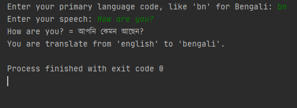

# Translator-with-Google-Translate-API-in-Python
Translate Any language of text by Google Translate API in python

In this code use 'googletrans' python package. so you have to install this package before run this code.

package install command: pip install googletrans

<h4> Out put like this</h4>

